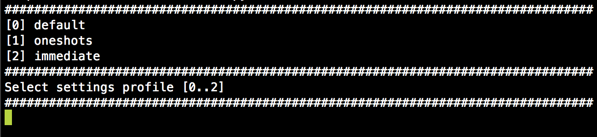
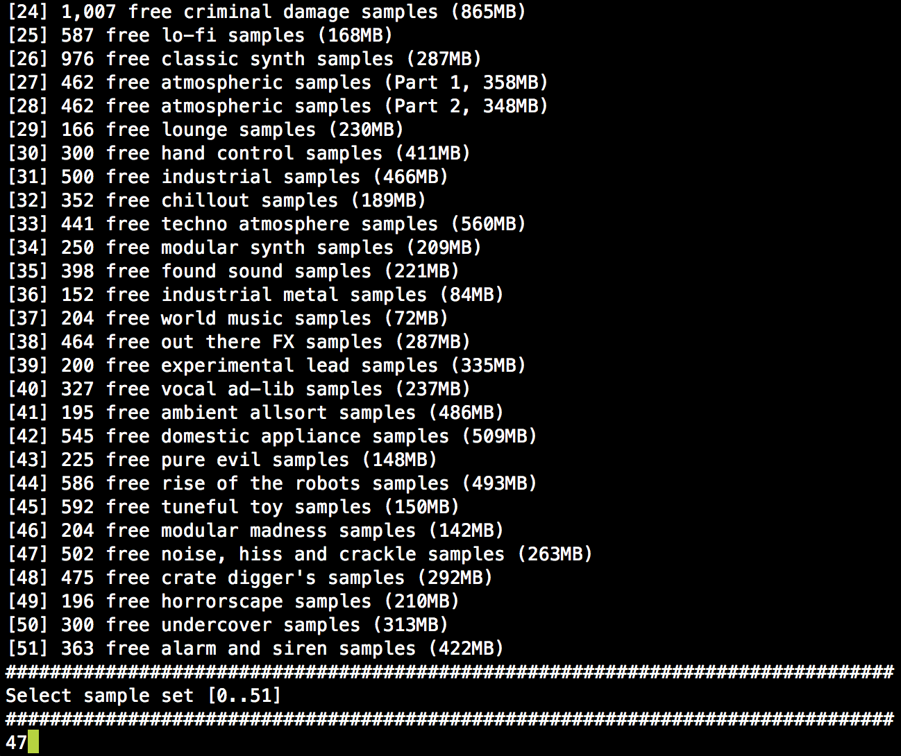
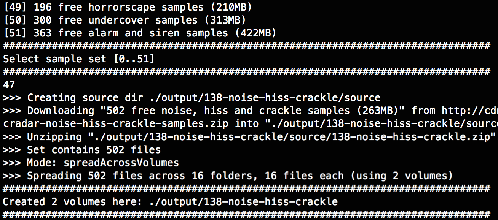

# Format Radio

## Helping you get sound packs into your Radio Music

### What it is

This is a small command line tool written in Python that prepares sound packs for use with [Music Thing Modular's Radio Music](https://github.com/TomWhitwell/RadioMusic).

### What it does

* Downloads sound packs from a configurable ["repository"](data.json), currently stocked with a selection of [packs from Music Radar](http://www.musicradar.com/news/tech/free-music-samples-download-loops-hits-and-multis-217833/)
* Converts WAV files to RAW (according to [Radio Music specs](https://github.com/TomWhitwell/RadioMusic/wiki/SD-Card%3A-Format-%26-File-Structure#setting-up-files-on-the-micro-sd-card))
* Renames files to ensure 8.3 names (no clever shortening, just sequential naming of the files)
* Creates compatible folder structure (16 folders with 75 files max, no more than 330 files in total)
* Splits sound packs with more files across multiple volumes, ie multiple SD cards.

### What it doesn't do

The Radio Music plays mono files and SD cards are cheap, so the actual size of the files is not considered at all, the tool only handles converting the files and spreading them across a useful and valid folder structure.

The tool doesn't have anything to do with the SD cards themselves, it merely creates a ``settings.txt``, files and folders for you to copy onto a card.

## Requirements

* [Python](https://www.python.org/downloads/release/python-279/) (already available if you're on OS X 10.8+)
* [ffmpeg](https://www.ffmpeg.org/download.html)

## Installation

* [Download the ZIP](https://github.com/apolakipso/FormatRadio/archive/master.zip) and extract it to a folder
* Open a terminal and change into that folder
* Run the script with Python

```bash
$ cd ~/Downloads/FormatRadio-master/	# wherever you unzipped the files
$ python create.py						# run script
```

### Select Profile
Select a profile, this defines settings for the module (see the **profiles** key in [config.json](config.json)). All profiles are based on the **default** profile, so you only need to specify settings that deviate from the default settings.

**Enter the number of the profile you want to use:**



### Select Sound Set

The tool lists all configured sample packs with number of samples and the size of the archive (NB: This is the filesize of the WAVs, after conversion the resulting files will likely be half that).

**Enter the number of the sample pack you want to create:**



### Processing

Now the sound pack zip will be downloaded, files will be extracted and converted, settings files will be written, all that.



**Please note: Currently there is no download progress indicator - depending on the size of the zip, it might just sit there for a bit - give it ample time to finish. No news is good news in this case. I'm looking into how to display a progress indicator.**

Once done, the tool will open the folder containing all the volumes created from the sample pack. You can now copy the contents onto an SD card.

## Configuration
The file [config.json](config.json) configures a few things. More documentation to follow.

* **rootFolder** sets the path where files are created. *Default: "./output/"*
* **maxFilesPerVolume** sets the maximum number of files the Radio Music module can handle (on a single SD card). *Default: 330*
* **maxFolders** sets the maximum number of folders the Radio Music module can handle. *Default: 16*
* **maxFilesPerFolder** sets the maximum number of files per folder the Radio Music can handle. *Default: 75*
* **overwriteConvertedFiles** determines whether ffmpeg is instructed to overwrite existing (RAW) files when converting. *Default: true*
* **mode** determines how files are spread across folders and multiple volumes (large sample packs with more than 330 files can span multiple cards). *Default: "spreadAcrossVolumes"*
	* **spreadAcrossBanks** spreads all the files from a sample pack evenly across the banks (330 at the most), this is mostly useful with less than 330 files.
	* **spreadAcrossVolumes** spreads all the files from a sample pack evenly across the number of volumes required - this should give you the best overall result for large banks.
	* **maxCapacity** uses 75 samples per folder and fills each volume to the brim (16 folders, 330 files max). This fills up everything as dense as possible, you might end up with an almost empty last volume though.
	* **voltOctish** uses 60 samples per folder - with CV between 0..+5V we might be able to select a sample per semitone. Untested, possibly even unfounded.
* **profiles** defines different settings you can select for a sound pack, [read up in the wiki on what the settings mean](https://github.com/TomWhitwell/RadioMusic/wiki/Customise-your-module%3A-Editing-settings.txt). The key **_name** is used to identify the profiles, it will not be written to ``settings.txt``.

## Sample Pack Repository

The file [data.json](data.json) lists the sample packs. Basically, this is a list of URLs to ZIP files containing WAV files.

A sample pack is defined by the following properties:

* **key** folder names will be derived from this, must be a valid folder name
* **name** the name of the sample pack as it will be displayed in the selection list
* **url** URL of the zip file to download
* **source** optional URL for the sample pack's website (not used anywhere yet)

```json
{
	"key": "29-dark-dub",
	"name": "358 free dark dub samples (379MB)",
	"url": "http://cdn.mos.musicradar.com/audio/samples/musicradar-dark-dub-samples.zip",
	"source": "http://www.musicradar.com/news/tech/free-music-samples-download-loops-hits-and-multis-217833/29"
}
```
## Roadmap

* Allow selection of local folder instead of a repo entry
* Add download progress info, check whether pywget is better suited than urllib2
* Fix wording, is it a sound pack, a sound set, or what?

## Notes

* This has currently been tested on OS X only
* The script uses ffmpeg to convert WAV to RAW files, this can probably be changed to use [SoX](sox.sourceforge.net) quite easily
